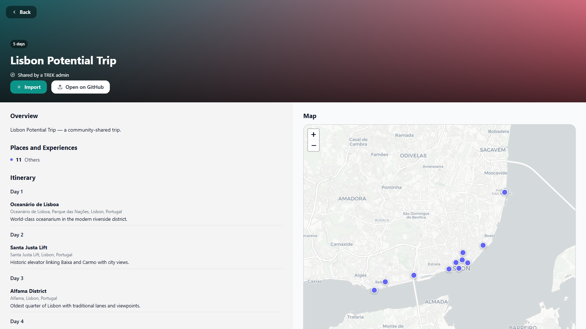

# Community Trips

Browse real trips other TREK admins have shared, discuss them, and share your
own — reviewed via a GitHub pull request, with a Discussion thread for
suggestions.

## What it does

Community Trips is a standalone TREK page listing real trips other admins
have shared — not curated guides, actual itineraries from someone's own
trip, reviewed via a pull request before they land here. It started life as
a tab inside the **Featured Guides** plugin's marketplace; it's a separate
plugin now because sharing/browsing here needs a very different trust model
(a GitHub personal access token, PRs, public Discussions) than a plain
curated-content library does.

**Browse** — a searchable list of shared trips, the most recent as a big
hero banner and the rest as a card grid, each showing a cover, location,
author, and a place/day count. **View** opens a full trip detail page: the
day-by-day itinerary alongside an interactive map (every place with
coordinates gets a pin) and the trip's **Suggestions** thread — a place to
add, a day to reorder, a heads-up about something that's changed — read and
posted right there without leaving TREK. **Import** pulls a trip in as a
local, read-only draft copy under **My imported trips** on the same page;
removing one only deletes your local copy, nothing on GitHub changes.

**Share a trip** — pick one of your own TREK trips and this opens a pull
request against the shared marketplace repo (adding
`marketplace/trips/<slug>.json` and listing it in
`marketplace/trips/index.json`), plus a GitHub Discussion seeded with a
summary and a link back to the PR. A trip that's already been shared shows
**Suggestions** instead of **Share** in the picker, and re-sharing is safe —
it reuses the existing pull request and Discussion rather than opening
duplicates (including finding a same-titled Discussion by search, so this
still holds even if this plugin's own local "already shared" record is
ever lost).

Sharing and posting a suggestion both need a GitHub personal access token
pasted into this plugin's settings — per-user, same pattern as any other
TREK plugin that talks to an external API on your behalf. Without one,
Share and Suggestions both explain what's missing instead of failing
silently. Browsing and importing need no setup at all.

## Screenshots

The browse list: each shared trip shows its title, day/place count, and
author, with **Import** and **View** (suggestions + itinerary) actions.
Admins also see **Share a trip** in the top-right corner.

## Permissions

| Permission | Why |
|---|---|
| `db:own` | Stores this user's locally-imported trip drafts, and the bookkeeping for trips this instance has shared (so re-sharing shows "Suggestions" instead of opening a duplicate PR). |
| `http:outbound` | Marker permission required alongside the specific outbound hosts below. |
| `http:outbound:raw.githubusercontent.com` | Lets the browse list and itinerary/suggestion previews read the shared marketplace repo's plain JSON — no key or account needed, and nothing is sent there; it's read-only. |
| `http:outbound:api.github.com` | Lets **Share a trip** and **Suggestions** open a pull request, commit the trip JSON, and create/read/post on its linked GitHub Discussion, using the admin's own personal access token — never this plugin's. |
| `http:outbound:basemaps.cartocdn.com` | Loads the free, keyless map tiles shown on a trip's detail page (via CARTO's basemap CDN) so places with coordinates render as pins on a real map. No account or key needed, and nothing about you is sent there beyond the tile coordinates being viewed. |
| `db:read:trips` | Lists the signed-in user's own trips so they can pick which one to share. |

## Setup

1. Install the plugin — no setup is required just to browse trips, view
   their itineraries, or import one.
2. Any admin who wants to **Share a trip** or post a **Suggestion** needs a
   GitHub personal access token, fine-grained and scoped to just
   `raduwolf12/featured-guides` with Contents, Pull requests and Discussions
   write access, pasted into their own **GitHub personal access token**
   field on this plugin's settings page — per-user, each admin uses their
   own token. A **Test connection** button on that same settings page
   checks it right away.
3. Open the **Community Trips** page from the main navigation.

## License

MIT
